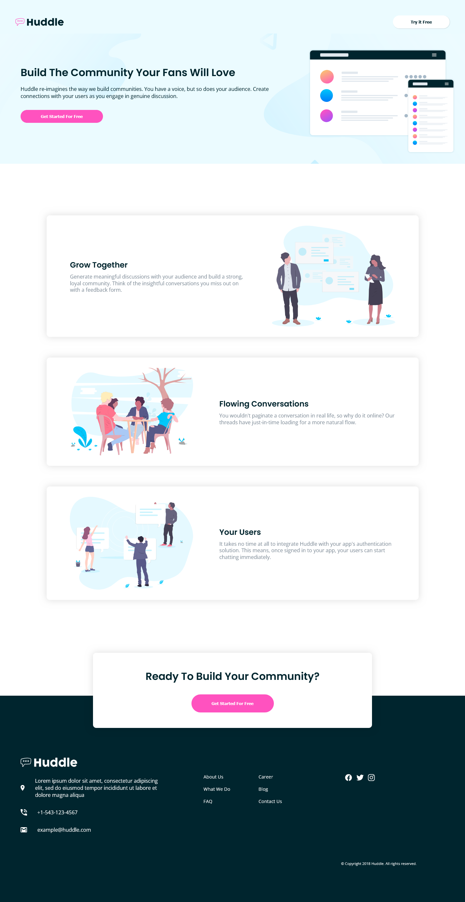

# Frontend Mentor - Huddle landing page with alternating feature blocks solution

This is a solution to the [Huddle landing page with alternating feature blocks challenge on Frontend Mentor](https://www.frontendmentor.io/challenges/huddle-landing-page-with-alternating-feature-blocks-5ca5f5981e82137ec91a5100). Frontend Mentor challenges help you improve your coding skills by building realistic projects. 

## Table of contents

- [Overview](#overview)
  - [The challenge](#the-challenge)
  - [Screenshot](#screenshot)
  - [Links](#links)
- [My process](#my-process)
  - [Built with](#built-with)
  - [What I learned](#what-i-learned)
  - [Continued development](#continued-development)
  - [Useful resources](#useful-resources)
- [Author](#author)
- [Acknowledgments](#acknowledgments)

## Overview

### The challenge
The challengue consisted in develop a responsive static page with it's due styles depending on the screen width

Users should be able to:

- View the optimal layout for the site depending on their device's screen size
- See hover states for all interactive elements on the page

### Screenshot
  

### Links

- Solution: [Solution URl](https://www.frontendmentor.io/solutions/responsive-static-landing-page-usign-html5-and-css-BppkGLDqjr)
- Live Site: [Live site URL](https://devnielote.github.io/huddle-landing/)

## My process

### Built with

- Semantic HTML5 markup
- CSS custom properties
- Flexbox
- Mobile-first workflow

### What I learned

This time I use custom properties from the begining and it actually improves the way I write the CSS, it felt more fluid and easy to achieve the design

### Continued development

I will focus on using more custom properties and pure css tools to understand what is going on behind the css frameworks.

## Author

- Frontend Mentor - [@Devnielote](https://www.frontendmentor.io/profile/Devnielote)

